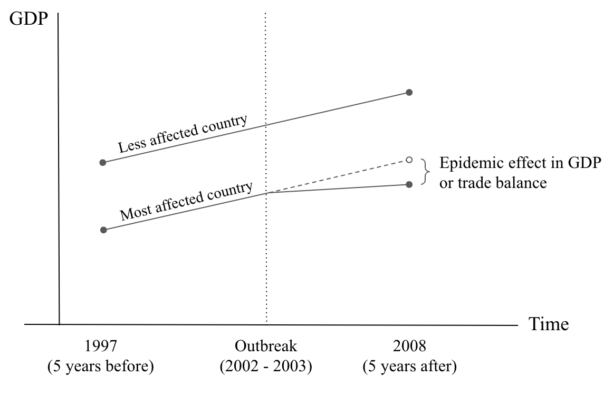

# Final Project Proposal
#### Unifying Data Science II - Spring 2020
March 21, 2020

Jose Luis Moscoso | Juli You | Ana Belen Barcenas

## Topic 
In this project, we will focus on the influence of the COVID-19 virus on unemployment insurance weekly claims in the USA. We will perform a comparison of unemployment claims between the states that have put in place statewide stay-at-home/shelter-in-place orders and those states that have not placed any order at all.

## Motivation
We are currently experiencing one of the deadliest pandemics in human history. As of now, the effects in the economy due to travel restrictions, stay-at-home/shelter-in-place orders, closure of small businesses, and so on are starting to be evident and concerning in many countries. 

In the USA (as of March 30, 2020) 30 out of 50 states have asked their residents to avoid going out unless they work for essential businesses or to do other necessities such as go to the grocery store, hospitals, take care of an affected family member, and some others. As an effect of these measures, businesses are facing a large decrease in sales and revenues, which causes workers to be laid off and some companies have frozen hiring processes. According to a [study](www.stlouisfed.org/on-the-economy/2020/march/back-envelope-estimates-next-quarters-unemployment-rate) published by the Federal Reserve Bank of St. Louis on March 24, the unemployment rate could reach 32% in the second quarter of the year. 

As a result of this analysis, we will be able to measure the impact of the measures taken to stop the spread of the COVID-19 virus on unemployment. Our results are taking into account only beneficiaries of federal unemployment insurance who are citizens or eligible to work non-citizens that meet their’s state criteria to be insured.
countries took to recover from previous epidemics and how effective their economic decisions were.

## Project Question
Will the stay-at-home/shelter-in-place order have an impact on unemployment claims? If so, what is the impact on the states that issued the order due to COVID-19, compared to those without the order?

## Project Hypothesis
We aspire to estimate the impact of stay-at-home/shelter-in-place order due to COVID-19 on unemployment claims. We choose the number of unemployment claims as the measure of unemployment with the assumption that unemployed US citizens and eligible non-citizen workers will file for unemployment insurance.

We expect that the number change in unemployment claims, before and after issuing stay-at-home/shelter-in-place order, will differ from the number in the states with similar pre-order trendings in unemployment filings.

## Data 
#### Unemployment Insurance weekly claims:
Features: Time series (weekly) data with seasonal and non seasonal adjustment records of new and persistent unemployed people. It records an exponential growth for the week of March 21st of 1,052.9% due to coronavirus. Only consider residents qualified to claim unemployment insurance, non-internationals. Period available: 1960 - 2020, weekly updates.

#### Stay-at-home/Shelter-in-place order
Features: Data sourced from press coverage grouping information by state and county level. Includes total, partial and current non stay-at-home/shelter-in-place orders across the US. Each row includes the dates and scope of restriction, either statewide or no order at all. 
* Statewide stay-at-home/shelter-in-place order states: California, NY, North Carolina, Washington and Massashusetts
* No stay-at-home/shelter-in-place order: North Dakota, South Dakota, Nebraska, Iowa and Nevada

## Model
Difference-in-differences

The diff-in-diff approach allows us to compare states that have followed the same unemployment claims trend before the stay-at-home order. Ideally, we will find a couple of states that, besides having the same unemployment claims trend, one was more affected by the measures to stop the spread of COVID-19 virus than the others.

## References
* https://www.nytimes.com/interactive/2020/us/coronavirus-stay-at-home-order.html
* https://www.wsj.com/articles/a-state-by-state-guide-to-coronavirus-lockdowns-11584749351?mod=theme_coronavirus-ribbon
* https://www.dol.gov/ui/data.pdf
* https://www.dol.gov/general/topic/unemployment-insurance
* https://www.businessinsider.com/fed-unemployment-forecast-coronavirus-pandemic-millions-layoffs-record-rate-jobs-2020-3
* https://www.stlouisfed.org/on-the-economy/2020/march/back-envelope-estimates-next-quarters-unemployment-rate
* https://github.com/nytimes/covid-19-data
* https://oui.doleta.gov/unemploy/claims.asp

