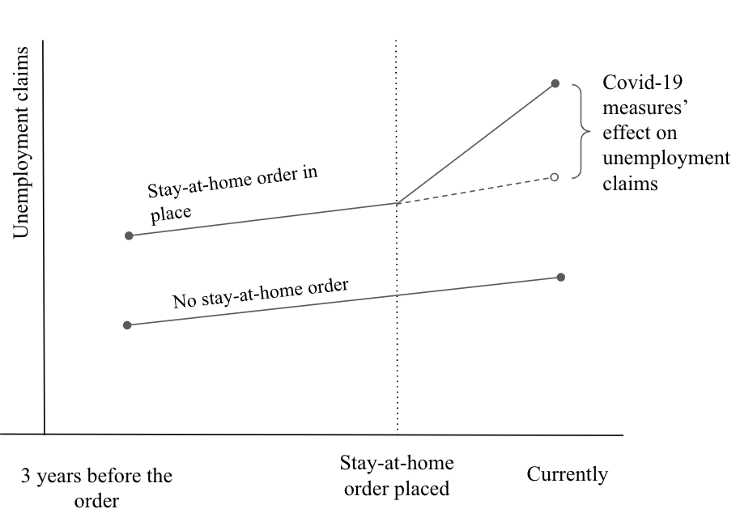

# Final Project Proposal
#### Unifying Data Science II
March 21, 2020

Jose Luis Moscoso | Juli You | Ana Belen Barcenas

## Topic 
In this project, we will focus on the influence of epidemics in the economy. We will perform a comparison of the economy (GDP and Trade Balance) between the most affected countries and those with minimal exposure to the virus. Specifically, we want to analyze the four epidemics - Hong Kong flu in (1968 - 1970), SARS (2002 - 2003), swine flu (2009 - 2010), and Ebola (2014 - 2016).

## Motivation
We are currently experiencing one of the deadliest pandemics in human history. As of now, the effects in the economy due to travel restrictions, lockdown measures, closure of small businesses, and so on are starting to be evident and concerning in many countries. To better understand how severe the effects of COVID-19 could be, we want to measure the impact of previous epidemics in long-term growth and trade.
As a result of this analysis, we will be able to suggest how large the impact on the economy will be for the current COVID-19 pandemic. The findings could give clarity on how to prepare and where to allocate resources at this moment. In addition, we can also gauge how long the affected countries took to recover from previous epidemics and how effective their economic decisions were.

## Project Question
1. Will the epidemics have an impact on Trade Balance? If so, what is the impact on countries affected by the epidemics and those not affected by the epidemics?
2. Will the epidemics have an impact on GDP? If so, what is the impact on countries affected by the epidemics and those not affected by the epidemics?

## Project Hypothesis
We aspire to estimate the economic impact of epidemics, by comparing regions that faced some of the most relevant healthy challenges, such as SARS, swine flu. We expect that economic metrics such as GDP or the trade balance, before and after the epidemic, will differ in countries with similar trends pre-epidemic that were more or less impacted by the viruses. 

## Data 
* Features: Year, Country, Trade Balance, GDP,  indicators for Hong Kong flu, SARS, Swine flu, and Ebola.  
* Period of time available:
  GDP: 1960 - 2018
  Trade Balance: 1980 - 2018  (ideally starting from 1960, but we can only get the data starting from 1980)

Each row represents yearly economic data per country. 

## Model
Difference-in-differences
The diff-in-diff approach allows us to compare countries that have followed the same GDP or trade balance trend before the outbreak of an epidemic. Ideally, we will find a couple of countries that, besides having the same GDP or trade balance trend, one was more affected by an epidemic outbreak than the other.

## References
* Infographic - deadliest epidemics in the history https://www.visualcapitalist.com/history-of-epidemics-deadliest/
* Table with the countries impacted by SARS in 2002-2003 https://www.who.int/csr/sars/country/2003_08_15/en/
* Table with the countries impacted by swine flu in 2009 https://www.who.int/csr/don/2009_08_04/en/
* Data sets  – Trading economics https://tradingeconomics.com/china/balance-of-trade
* Data sets - GDP https://data.oecd.org/gdp/gross-domestic-product-gdp.htm

